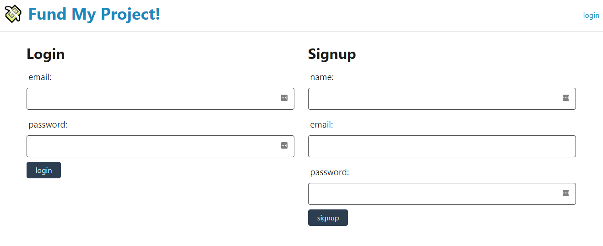
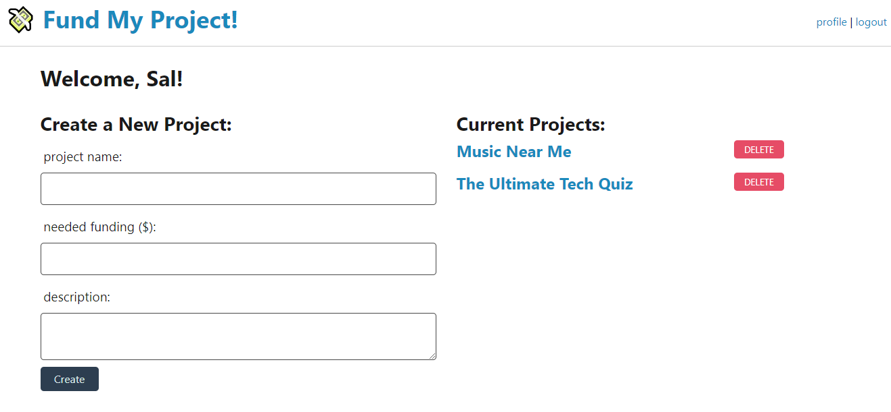

# Unit 14 Mini-Project: Crowdfunding App

In this mini-project, you will work with a group to build a full-stack crowdfunding app using Node.js, Express.js, Sequelize, Handlebars.js, and MVC architecture.

## User Stories

- As a user, I want to see a list of current projects seeking funding.

- As a user, I want to be able to create an account.

- As a registered user, I want to post my own projects to ask for funding.

### Acceptance Criteria

- It's done when the `/` homepage route renders a list of all projects from the database.

- It's done when the `/project/:id` route renders an individual project's details based on the route parameter id.

- It's done when the `/login` route renders a form to log in and a form to create a new account.

- It's done when an existing user can enter their credentials on the login page to create a session on the server.

- It's done when a new user can create an account on the login page and then be immediately logged in with a session.

- It's done when the `/profile` route renders the logged-in user's projects and a form to create a new project.

- It's done when only a logged in user can visit the `/profile` route.

- It's done when a logged in user is redirected to `/profile` when they try to visit `/login` again.

- It's done when a user on the profile page can use the form to create a new project in the database.

- It's done when a user on the profile page can select a "Delete" button to remove their project from the database.

- It's done when a logged-in user can select a "Logout" button to remove their session.

- It's done when the API routes to create and delete posts are protected from non logged-in users.

- It's done when the code is organized using MVC architecture.

- It's done when the views are rendered with Handlebars.js templates.

## Specifications

- The database models have the following fields and associations:

  - `User`

    - `id`: primary key

    - `name`

    - `email`

    - `password`

  - `Project`

    - `id`: primary key

    - `name`

    - `description`

    - `date_created`

    - `needed_funding`

    - `user_id`: foreign key that references `User.id`

  - Users have many projects, and projects belong to a user.

    - If a user is deleted, all associated projects are also deleted.

---

## 💡 Hints

- What tools can you use to test the existing API routes if you don't yet have a front end?

- Where would you place the client-side JavaScript for capturing form data?

- How can middleware help protect routes from non logged-in users?

- How can Handlebars.js helpers (both built-in and custom) be used to render the desired results?

## 🏆 Bonus

If you have completed this activity, work through the following challenge with your partner to further your knowledge:

- Add an `/edit/:id` route for logged in users to update their projects' details. Then deploy the app to Heroku!

## Assets

### Home View

### Project View

### Login View

### Profile View

---

© 2021 Trilogy Education Services, LLC, a 2U, Inc. brand. Confidential and Proprietary. All Rights Reserved.
