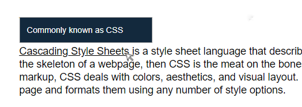

# 📖 Implement a CSS Tooltip

Work with a partner to implement the following user story:

- As a user, I want to hover over keywords and read short info on them instead of having all of the text on the page.

## Acceptance Criteria

- It's done when special keywords are underlined and change the cursor to a hand icon when the user hovers over them.

- It's done when the user hovers over a keyword and a rectangular tooltip appears next to the keyword.

  - For example, if the keyword is "Cascading Style Sheets," the tooltip would say, "Commonly known as CSS."

  - It's done when the tooltip has the same background color and text color as the header and navbar items.

## 📝 Notes

Refer to the following documentation:

[MDN Web Docs on ::after](https://developer.mozilla.org/en-US/docs/Web/CSS/::after)

## Assets

The following image demonstrates the web application's appearance and functionality when the cursor is over the "Cascading Style Sheets" link:

---

## 💡 Hints

- How can we use the `::after` pseudo-element along with the `:hover` and `:focus` selectors to create the tooltip?

- How can you designate the keyword to use a `data-descr` custom data attribute for the tooltip text?

## 🏆 Bonus

If you have completed the activity and want to further your knowledge, work through the following challenge with your partner:

- What are some real-life scenarios for using pseudo-elements?

Use [Google](https://www.google.com) or another search engine to research this.

---

© 2021 Trilogy Education Services, LLC, a 2U, Inc. brand. Confidential and Proprietary. All Rights Reserved.
